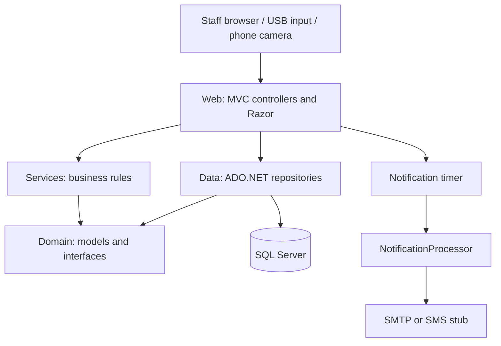
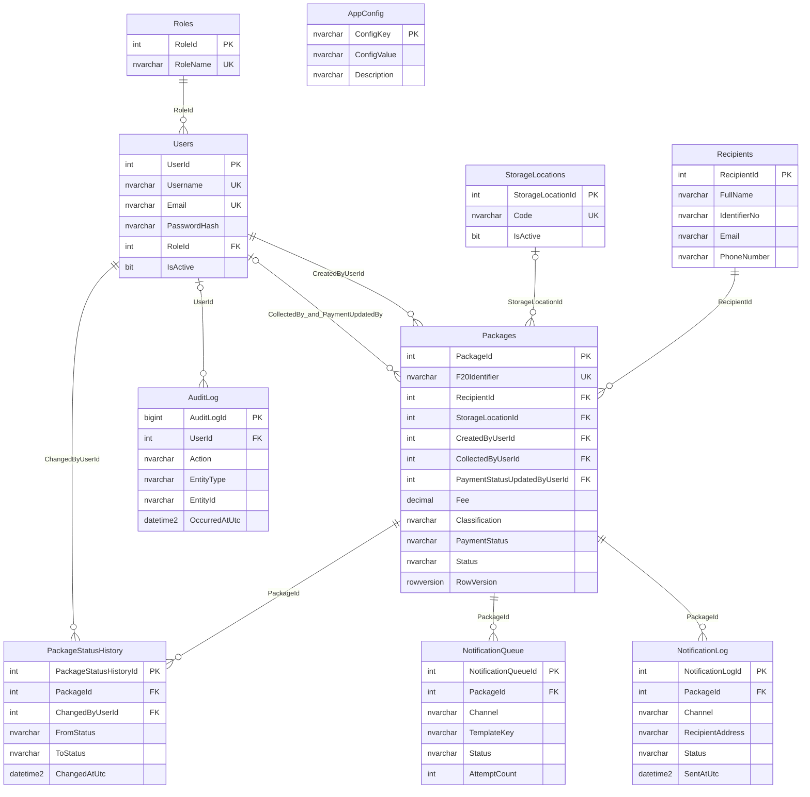

# Technical documentation (T59)

## System and scope

This staff-only application handles intake, storage, notifications and collection at NWU F20. It uses C#, .NET Framework 4.8, ASP.NET MVC 5 and SQL Server Express/LocalDB. The package lifecycle is `Registered -> InStorage -> ReadyForCollection -> Collected`. Recipients have no portal. QR payloads contain the internal package identifier only.

Scope decisions are recorded in [DECISIONS.md](../DECISIONS.md), routes and roles in [API_CONTRACT.md](API_CONTRACT.md), and tables in [schema.sql](../db/schema.sql). The functional specification's 20-user target conflicts with the decisions log's five-user demo target; acceptance must identify which target applies.

## Architecture and dependencies

Services depends on Domain, not Data. Web constructs concrete repositories and passes them through Domain interfaces to services; those repositories execute SQL at runtime. SQL access is confined to Data. The browser talks to MVC endpoints; the included Web API packages do not make these controllers Web API controllers.

| Layer | Responsibilities |
| --- | --- |
| Domain | Entities, report/search models, repository and transaction interfaces |
| Services | Validation, fees, transitions, collection, payment, authentication, notifications and audit |
| Data | Parameterized commands, mapping, connection ownership and transactions |
| Web | HTTP parsing, session/role filters, service composition, Razor, browser scripts |
| Tests | MSTest unit and SQL integration tests; standalone JavaScript checks in relevant fix branches |

`UnitOfWork` owns one connection and transaction, commits explicitly and otherwise rolls back. Registration atomically creates recipient/package/history/audit records. Status changes atomically update a row-version-checked package, append history/audit entries and enqueue notifications. Payment changes save payment metadata and audit entries together; their concurrency behavior needs the separate review fix.

## Installation and build

1. Install Visual Studio with the ASP.NET/web workload and .NET Framework 4.8 targeting pack; install SQL Server Express or LocalDB.
2. Check out the agreed release commit. Merge [seed fix #110](https://github.com/Gh0st-y/CMPG323-Courier-Service-Management-and-Tracking-System/pull/110) before initializing a fresh database.
3. Run `db/schema.sql`, then `db/seed.sql` on a development database containing synthetic data only. Scripts target `CourierService`; check the connection before execution. The optional `db/seed-50k.sql` adds performance fixtures.
4. Configure the `CourierServiceDb` connection string in Web/Web.config. LocalDB uses `Server=(localdb)\MSSQLLocalDB;Database=CourierService;Trusted_Connection=True;`. IIS hosting normally uses SQL Express and the app-pool identity; do not assume developer LocalDB is accessible to IIS.
5. Restore and build with Visual Studio/MSBuild. Use Release for a deployment package and enable `MvcBuildViews=true` to compile Razor views.
6. Start Web with IIS Express; development URLs are HTTP 44300 and HTTPS 44301. Phone access needs a LAN binding and a trusted certificate; see [README](../README.md).
7. Run unit tests with `dotnet test Tests/CourierService.Tests.csproj --filter 'FullyQualifiedName!~CourierService.Tests.Integration'`. Integration tests need their documented database; skips are not passes.

The project is a legacy web application with SDK-style supporting projects. Use Visual Studio MSBuild to build the whole solution; the dotnet SDK alone may lack the web application targets. Existing assembly-binding warnings need to be assessed separately.

## Configuration

| Source | Keys | Effect |
| --- | --- | --- |
| connectionStrings | `CourierServiceDb` | Host database connection |
| dbo.AppConfig | `Fee.Personal`, `Fee.WorkRelated` | Future package fees; existing saved fees stay unchanged |
| dbo.AppConfig | `Notification.ReadyForCollection.Subject`, `.Body`; `Notification.Collected.Subject`, `.Body` | Read when composing a notification |
| appSettings | `Smtp.Host`, `.Port`, `.FromAddress`, `.FromName`, `.UseSsl`, `.UserName`, `.Password`, `.TimeoutSeconds` | SMTP transport; default timeout 10 seconds |
| appSettings | `Sms.Enabled` | Queue/use SMS stub as well as email when enabled |
| appSettings | `Sms.Provider` | Reserved; only Stub is implemented |
| appSettings | `Notifications.WorkerEnabled`, `.PollSeconds`, `.MaxAttempts`, `.RetryDelaySeconds` | Worker defaults when settings are absent: enabled, 5-second poll, 3 attempts, 60-second delay |
| appSettings | `Https.RedirectEnabled`, `Https.Port` | Development HTTP redirect |
| system.web/sessionState | `timeout` | Actual inactivity timeout, currently 30 minutes |

`Session.InactivityTimeoutMinutes` is not consumed by the session runtime. The database `Sms.Enabled` default is not consumed by service composition: use the Web appSetting. Avoid maintaining conflicting values.

[Configuration PR #113](https://github.com/Gh0st-y/CMPG323-Courier-Service-Management-and-Tracking-System/pull/113) adds a fee-only endpoint for intake/supervisors/admins and removes the registration page's hard-coded fallback. It also makes the optional, ignored `Web.config.Local` appSettings file load. Until that PR is merged, merely creating this file has no effect. Its XML root must be `<appSettings>`; it does not override connectionStrings.

Notification placeholders: `{{RecipientName}}`, `{{PackageId}}`, `{{StorageLocation}}`, `{{CollectionTime}}`. Database fees/templates are read afresh without rebuilding. Changing Web.config may recycle the app; this is different from recompiling. Keep SMTP credentials and deployed connection strings outside source control.

The full `/api/config` management API and Config navigation page are not implemented. SQL administrators currently maintain database settings; audited staff configuration updates remain separate work.

## Database / ERD

The following relationships are taken from schema.sql. A label naming several columns represents multiple foreign keys between those entities.

AppConfig has no foreign keys. NotificationLog references the package, not a queue entry. Failed login audit entries may have no user. Registration takes a recipient snapshot in a new row; IdentifierNo is not a unique person registry. The diagram shows principal fields; schema.sql remains authoritative for every column, index and length.

## CSV ingestion and a future API

The backend path is `ImportController.Csv -> CsvPackageImport -> IPackageRegistrationService.Register`. The translator resolves storage codes and maps columns; the shared service applies recipient validation, classification, configured fee, payment defaults, identifier allocation, history and audit. Structural header errors reject the file; invalid data rows are skipped and reported. Each valid row commits separately, so an unexpected failure after some rows have committed requires checking saved records before retrying.

Required columns are `RecipientFullName, RecipientIdentifierNo, RecipientEmail, RecipientPhone, SenderName, PackageType, Classification, StorageLocation`; `RecipientDepartment` and `Notes` are optional. The server generates identifiers and fees. [CSV fix #111](https://github.com/Gh0st-y/CMPG323-Courier-Service-Management-and-Tracking-System/pull/111) connects the browser page to this backend; the old page only simulates imports locally.

To add an approved live ingestion source later:

1. Add a translator mapping external records into `PackageRegistrationRequest`.
2. Authenticate and authorize the ingestion endpoint separately.
3. Resolve storage references and call the same registration service; do not duplicate its fee/status rules.
4. Define idempotency, external reference mapping, ownership and failure/retry policy before enabling repeat imports.
5. Keep CSV available until the replacement passes the same acceptance checks.

No live NWU integration is authorized by this design. Protocol and data-owner approval remain open scope dependencies.

## Notifications and operations

Status listeners enqueue ReadyForCollection/Collected work in the package transaction. An ASP.NET timer processes batches in the hosting application. It is not a separately installed, durable worker: application startup, idle shutdown and recycle affect processing. Keep the demo app running and confirm the local SMTP inbox is reachable. Missing SMTP Host selects a trace sender, which does not deliver mail.

The timer prevents overlapping batches in one process. Multi-process claiming, delivery-log durability and staff-visible failure reasons remain review findings. The resend endpoint exists, but the detail-page Resend button is missing. SMS is a development stub and does not send real messages.

## Roles and known limitations

Five roles are defined: IntakeClerk, StorageStaff, CollectionStaff, Supervisor, SystemAdmin. Server-side RoleAuthorize filters reject unauthorized actions. Sessions currently keep roles from login; account changes do not immediately revoke them. API anti-forgery protection is outstanding. [Package-page fix #112](https://github.com/Gh0st-y/CMPG323-Courier-Service-Management-and-Tracking-System/pull/112) removes unsafe identifier insertion into scripts.

The audit query endpoint exists; audit viewer UI is missing. Storage-location listing exists; the pending creation PR needs integration corrections. Camera scanning currently loads a library from external CDNs. These limitations must appear in the release acceptance checklist rather than being hidden by documentation.

## Verification and handover

[T47 report verification PR #114](https://github.com/Gh0st-y/CMPG323-Courier-Service-Management-and-Tracking-System/pull/114) records SQL-backed totals and date-boundary checks. Reports describe current statuses of a receipt cohort, not payment transactions made during the range.

Use [NEGATIVE_TESTS.md](NEGATIVE_TESTS.md) for rejection/outage scenarios and [RELEASE_CHECKLIST.md](RELEASE_CHECKLIST.md) for release evidence. Device/browser checks, performance at 50,000 packages and 500,000 audit entries, backup restoration, staff training and sponsor approval need recorded results. Do not use real recipient information before the required governance approval. Retention period and anonymisation scope remain unresolved.

Updated 2026-10-10 against the reviewed main commit b8af68c and the explicitly identified pending PRs. Review those dependencies before using this document for a release.
